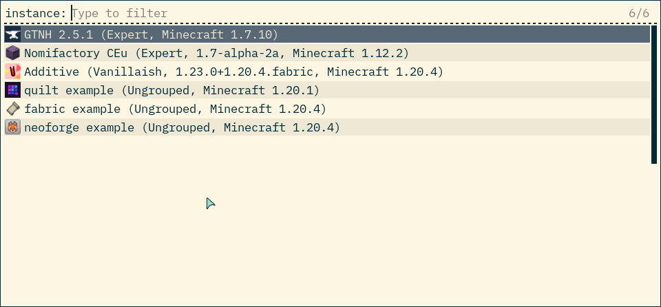

``prism-rofi``
==============

This is a helper script that allows running Prism Launcher instances from a ``dmenu``-compatible
runner. Despite the name, it supports multiple runners.

Usage
-----

1. Install the script, e.g. with ``pipx install prism-rofi``. Further packaging is a WIP.
2. Add a nice keybind in your settings to run ``~/.local/bin/prism-rofi`` with the right arguments.
3. Hit the button and enjoy.

Configuration
-------------

``prism-rofi`` is configured entirely with command line arguments.

Changing the Prism Dir
~~~~~~~~~~~~~~~~~~~~~~

By default, ``prism-rofi`` looks in ``$XDG_DATA_HOME/.PrismLauncher`` 
(which is usually ``~/.local/share/PrismLauncher``) for the Prism Launcher configuration file. You
can override this with the ``--config-dir`` option. ``prism-rofi`` will then use the instance and
icon directory settings specified in the configuration.

Changing the Runner
~~~~~~~~~~~~~~~~~~~

Don't use Rofi? That's fine. You can change the runner with the ``--runner`` option. You can also
pass the path of the runner with ``--exe`` if your chosen runner isn't on your ``$PATH``.

Currently supported runners:

- `rofi <https://github.com/davatorium/rofi>`__ (`wayland version <https://github.com/lbonn/rofi>`_)
- `wofi <https://hg.sr.ht/~scoopta/wofi>`__ (content warning: s\*rceh\*t link)
- `fuzzel <https://codeberg.org/dnkl/fuzzel>`__ 

Icons
-----

This project includes a small number of project icons used by various modloaders. These are:

- The `Fabric <https://fabricmc.net>`_ icon, used for Fabric instances
- The `Minecraft Forge <https://minecraftforge.net>`_ icon, used for legacy Forge instances
- The `Quilt <https://quiltmc.net/>`_ icon, used for Quilt instances
- The `NeoForge <https://neoforged.net/>`_ icon, used for NeoForge instances
- The `MultiMC grass icon` as shipped by Prism, used for vanilla/unrecognised instances

Special Credits
---------------

Shoutouts to the `kaokao <https://github.com/fruitsbat/kaokao>`_ project, which is what gave me this
idea in the first place!

.. _MultiMC grass icon: https://github.com/PrismLauncher/PrismLauncher/blob/43dd929214cfa84471460f6cf8547c7a3993831c/launcher/resources/multimc/32x32/instances/grass_legacy.png
